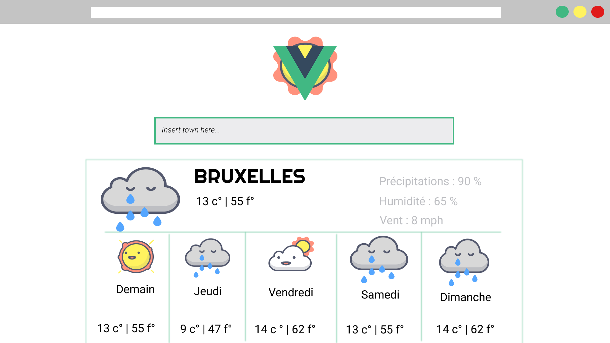

# Application Mets-tes-hauts

  

* Application de prévision météorologique créée par Gaëlle Gaban  ([Github](https://github.com/Gaellga)) et Teddy Wauquier ([Github](https://github.com/Elleonors))  
* Réalisé en avril 2019 dans le cadre de la formation BeCode  
* Exercice combinant l'utilisation d'une API avec l'apprentissage de VueJS. Le but ici était de récupérer le contenu du fichier .json généré par l'API et de l'afficher à l'aide de VueJS.  
* Projet terminé  

## Lien vers les consignes
https://github.com/becodeorg/BXL-Johnson-3.9/tree/master/Projets/Mets-Tes-Hauts

## Technologies utilisées  

* Javascript  
* HTML5  
* CSS  

## Framework et librairies

* VueJS  
* Axios  
* Bootstrap  

## Maquette

* Créée par Teddy à l'aide de [Figma](https://www.figma.com/)  

  

## Répartition du travail  

* Teddy : CSS, intégration de l'API, build
* Gaëlle : affichage de l'API (données météorologiques et images)

## Credits
* L'API utilisée se nomme *"5 day weather forecast"* et appartient au site [OpenWeatherMap](https://openweathermap.org/)  
* Toutes les images (favicon compris) sont tirées de [Flaticon](https://www.flaticon.com/packs/space-weather) (nous avons également employé le logo de VueJS)

  
### Vous pouvez accéder à l'application via la [Github page](https://elleonors.github.io/Mets-tes-hauts/) ou aller directement visiter son repository [ici](https://github.com/Elleonors/Mets-tes-hauts).
